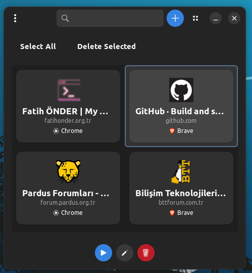
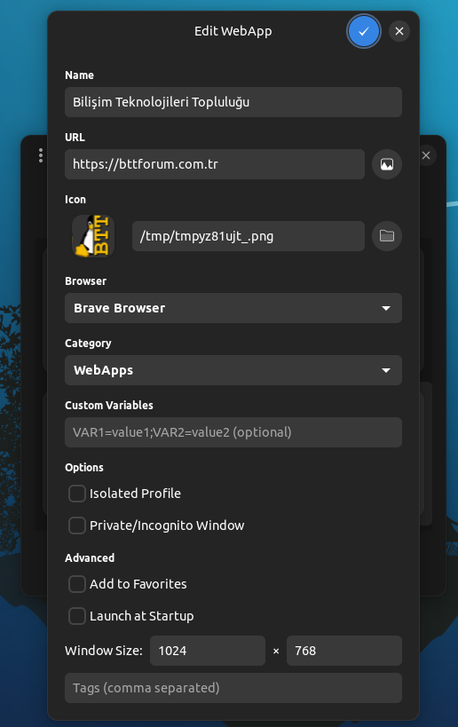
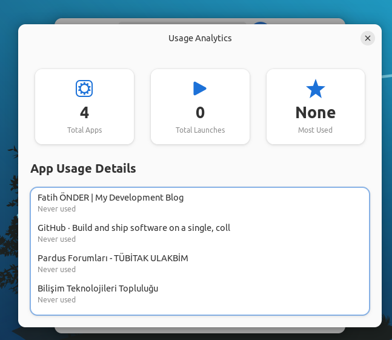
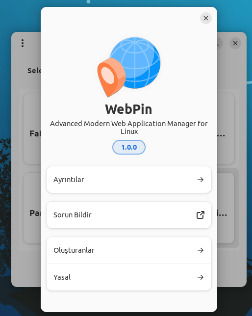

## [English Guide](https://github.com/cektor/WebPin/blob/main/README.md)

<a href="#">
    
</a>


# WebPin - Modern Web Uygulama Yöneticisi

<div align="center">


**Herhangi bir web sitesini yerel masaüstü uygulamasına dönüştürün**

[](https://opensource.org/licenses/MIT)
[](https://www.python.org/downloads/)
[](https://www.gtk.org/)

[Özellikler](#özellikler) • [Kurulum](#kurulum) • [Kullanım](#kullanım) • [Ekran Görüntüleri](#ekran-görüntüleri) • [Katkıda Bulunma](#katkıda-bulunma)

</div>

---

## 🌟 Özellikler

- **🎨 Modern GTK4/Libadwaita Arayüzü** - Güzel, yerel Linux masaüstü deneyimi
- **🌐 Çoklu Tarayıcı Desteği** - Firefox, Chrome, Chromium, Brave, Edge ve daha fazlasıyla çalışır
- **🔒 İzole Profiller** - Web uygulamalarını ayrı tarayıcı profilleriyle çalıştırın
- **🕶️ Özel Mod** - Uygulamaları gizli/özel tarama modunda başlatın
- **🎯 Otomatik Favicon İndirme** - Uygulama ikonlarını otomatik olarak alın ve ayarlayın
- **📊 Kullanım İstatistikleri** - En çok kullandığınız web uygulamalarını takip edin
- **🌍 Çoklu Dil** - İngilizce ve Türkçe dil desteği
- **🎨 Tema Desteği** - Açık, Koyu ve Otomatik tema modları
- **📤 İçe/Dışa Aktarma** - Web uygulamalarınızı yedekleyin ve geri yükleyin
- **🎁 Easter Egg** - Gizli sürpriz özellik (Hakkında'da logoyu 5 kez tıklayın!)

## 📋 Gereksinimler

- Python 3.8 veya üzeri
- GTK 4.0
- Libadwaita 1.0
- GObject Introspection
- Python GI bağlantıları
- PIL/Pillow (isteğe bağlı, daha iyi ikon işleme için)

## 🚀 Kurulum

### Kaynaktan

```bash
# Depoyu klonlayın
git clone https://github.com/cektor/WebPin.git
cd WebPin

# Bağımlılıkları yükleyin (Debian/Ubuntu)
sudo apt install python3-gi python3-gi-cairo gir1.2-gtk-4.0 gir1.2-adwaita-1 python3-pil

# Bağımlılıkları yükleyin (Fedora)
sudo dnf install python3-gobject gtk4 libadwaita python3-pillow

# Bağımlılıkları yükleyin (Arch)
sudo pacman -S python-gobject gtk4 libadwaita python-pillow

# Uygulamayı çalıştırın
python3 webpin.py
```

### Sistem Kurulumu

```bash
# Sisteme yükleyin
sudo cp webpin.py /usr/local/bin/webpin
sudo chmod +x /usr/local/bin/webpin

# İkonu yükleyin
sudo cp webpinlo.png /usr/share/pixmaps/

# Desktop dosyasını yükleyin
sudo cp webpin.desktop /usr/share/applications/

# Dil dosyalarını yükleyin
sudo mkdir -p /usr/share/webpin/language
sudo cp language/*.ini /usr/share/webpin/language/
```

## 💡 Kullanım

### Web Uygulaması Oluşturma

1. WebPin'i başlatın
2. **+** düğmesine tıklayın
3. Uygulama adını ve URL'sini girin
4. (İsteğe bağlı) Favicon'u otomatik indirmek için ikon düğmesine tıklayın
5. Tercih ettiğiniz tarayıcıyı seçin
6. Bir kategori seçin
7. Gerekirse gelişmiş seçenekleri yapılandırın
8. Kaydet'e tıklayın

### Gelişmiş Seçenekler

- **İzole Profil**: Uygulamayı ayrı bir tarayıcı profiliyle çalıştırın
- **Özel Pencere**: Gizli/özel modda başlatın
- **Özel Değişkenler**: Uygulama için ortam değişkenleri ayarlayın
- **Pencere Boyutu**: Özel pencere boyutları tanımlayın
- **Etiketler**: Uygulamaları özel etiketlerle düzenleyin

### Klavye Kısayolları

- **Arama**: Uygulamaları filtrelemek için yazmaya başlayın
- **Enter**: Seçili uygulamayı başlatın
- **Delete**: Seçili uygulamayı kaldırın
- **Ctrl+A**: Tüm uygulamaları seç

## 🎯 Desteklenen Tarayıcılar

- Firefox (tüm varyantlar)
- Chromium
- Google Chrome
- Brave
- Microsoft Edge
- Vivaldi
- Opera
- Epiphany/GNOME Web
- Ve daha fazlası!

## 📸 Ekran Görüntüleri









## 🛠️ Yapılandırma

WebPin yapılandırmasını şurada saklar:
- Yapılandırma: `~/.config/webpin/config.json`
- Dil: `~/.config/webpin/language.json`
- Desktop dosyaları: `~/.local/share/applications/webapp-*.desktop`
- İkonlar: `/usr/share/webpin/icons/`

## 🤝 Katkıda Bulunma

Katkılar memnuniyetle karşılanır! Lütfen bir Pull Request göndermekten çekinmeyin.

1. Depoyu fork edin
2. Özellik dalınızı oluşturun (`git checkout -b feature/HarikaBirOzellik`)
3. Değişikliklerinizi commit edin (`git commit -m 'Harika bir özellik ekle'`)
4. Dalınıza push edin (`git push origin feature/HarikaBirOzellik`)
5. Bir Pull Request açın

## 📝 Lisans

Bu proje MIT Lisansı altında lisanslanmıştır - detaylar için [LICENSE](LICENSE) dosyasına bakın.

## 👨💻 Yazar

**Fatih ÖNDER (CekToR)**
- GitHub: [@cektor](https://github.com/cektor)
- Web Sitesi: [algyazilim.com](https://algyazilim.com)

## 🏢 Şirket

**ALG Yazılım Inc.**
- Web Sitesi: [algyazilim.com](https://algyazilim.com)
- E-posta: info@algyazilim.com

## 🙏 Teşekkürler

- Harika araç seti için GTK ve GNOME ekiplerine
- WebPin'in tüm katkıda bulunanlarına ve kullanıcılarına
- Açık kaynak topluluğuna

## 🐛 Hata Raporları

Bir hata bulursanız, lütfen [GitHub Issues](https://github.com/cektor/WebPin/issues) üzerinde bir sorun açın.

---

<div align="center">

**ALG Yazılım Inc. tarafından ❤️ ile yapılmıştır**

*"Hayatta en hakiki mürşit ilimdir, fendir."* - M.Kemal ATATÜRK

</div>
